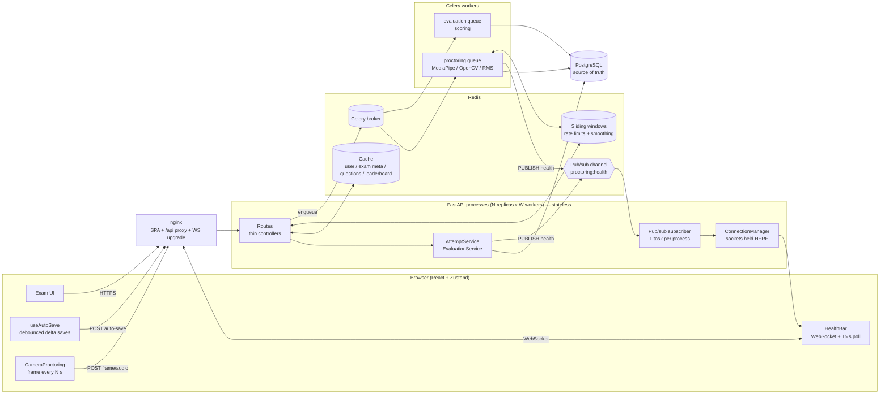

# Quizzie — High-Level Design

## 1. Requirements

**Functional:** examiners create exams (MCQ, multi-select, coding, subjective) and
publish them; students take a timed exam in the browser under camera/mic/browser
proctoring; answers are graded (auto for MCQ, manual for coding/subjective);
examiners watch a live feed and get analytics.

**Non-functional (the ones that drove the design):**

| Requirement | Target | Mechanism |
|---|---|---|
| No answer loss on crash / refresh / network drop | ≤ ~10 s of edits at risk | Durable delta auto-save (ADR 0001) |
| Exam time can't be extended from the client | server clock only, 30 s grace | Stored deadline (ADR 0002) |
| Exactly one attempt, submitted exactly once | under any concurrency | DB constraints + CAS (ADR 0003/0004) |
| Proctoring health correct under concurrent writers | no lost updates | Atomic UPDATE (ADR 0005) |
| Behaves the same with 1 or N API processes | no per-process state | Redis for shared state (ADR 0006/0007) |
| "Exam goes live" burst | 500 loads ≈ 1 DB query | Cache + single-flight (ADR 0008) |
| No head-of-line blocking / deadlock under burst | 200+ simultaneous starts | `run_db` discipline (ADR 0009) |

## 2. Architecture

**Principle:** API processes hold no state that matters to correctness. Postgres is
the source of truth; Redis holds shared-but-disposable state (cache, windows,
broadcast); the only per-process state is the set of open WebSockets, and
pub/sub makes *where* a socket lives irrelevant.

## 3. Components

| Component | Responsibility | Scales by |
|---|---|---|
| nginx | Static SPA, `/api` reverse proxy, WebSocket upgrade (dedicated location, 4 h read timeout) | Horizontal |
| FastAPI | Auth, validation, orchestration. Hot paths: `async def` + `run_db` unit of work | Horizontal (stateless) |
| `AttemptService` | Attempt lifecycle + its invariants (start/resume, save, submit, deadline) | — (library) |
| PostgreSQL | Attempts, answers, logs; enforces uniqueness & state transitions | Vertical, then read replicas for analytics |
| Redis | Cache, rate-limit/smoothing windows, pub/sub, Celery broker | Vertical; split roles into separate instances first |
| Celery `proctoring` | CPU-heavy frame/audio analysis, writes flags + health, publishes | Horizontal (CPU-bound) |
| Celery `evaluation` | Post-submit scoring, leaderboard invalidation | Horizontal |

## 4. Key data flows

**Start → take → submit**
1. `POST /attempts/start` — idempotent; returns the active attempt (partial unique index guarantees one).
2. `GET /attempts/{id}/state` — saved answers + `deadline` + `server_now` → client builds UI and a server-anchored countdown.
3. `GET /exams/{id}/questions` — served from cache (answer key stripped for students).
4. Edits → `POST /auto-save` deltas (debounced, single-flight, `client_seq`-ordered).
5. `POST /submit` with `Idempotency-Key` — CAS to `SUBMITTED` + final upsert in one transaction → Celery evaluation (or inline fallback) → leaderboard invalidated when scored.
6. Deadline passes with no submit → next touch closes the attempt with the saved answers.

**Proctoring**
Frame (640 px JPEG) → `POST /monitor/frame` (ownership + liveness check, Redis rate limit) → **mailbox**: overwrite `frame:<attempt>`, enqueue a tiny `{attempt}` task only if none is pending (else *coalesced*) → worker claims the newest frame (`GETDEL`) → MediaPipe → smoothing (Redis window) → `record_violations` (logs + atomic health update + counter + CAS auto-submit at 0) → snapshot `SET` + `PUBLISH` → every API process's subscriber → the process holding the student's (and examiner's) socket pushes it.

**End of exam**
Timer hits 0 → UI locks → submit after 0–10 s jitter → CAS close → evaluation queued with an `eval:pending` marker → `GET /results` returns `202` until the score exists (inline, single-flight fallback if the worker died).

## 5. Capacity estimate (back of the envelope — say the numbers out loud)

Assume **5,000 concurrent students**, auto-save every 10 s, health poll every 15 s, frames every `detection_interval` = 2 s.

| Flow | Rate | Notes |
|---|---|---|
| Auto-save | 5,000 / 10 s = **500 writes/s** | 1 upsert + 2 small reads each; comfortable for one Postgres primary |
| Health poll | 5,000 / 60 s ≈ 85 req/s (socket up) | served from a Redis snapshot: 0 SQL (was 4 queries each) |
| Exam-start burst | 5,000 question loads in ~seconds | ≈ 1 DB query with single-flight; the rest is Redis + JSON |
| WebSockets | 5,000 open sockets | spread over API processes; memory, not CPU |
| **Frames** | 5,000 / 2 s = **2,500 frames/s** | **the real bottleneck** ↓ |

At 200–400 ms of MediaPipe CPU per frame, 2,500 frames/s needs **~500–1,000 CPU cores**
of proctoring workers. Even at 500 students it's ~75 cores — far beyond the "4 workers"
in the compose file (≈ 13 frames/s ≈ 26 students).

**What changed (ADR 0010), and what didn't:**
- *Transport is now bounded.* Frames no longer ride inside broker messages. A
  per-attempt mailbox keeps ≤ 1 frame and ≤ 1 queued task per student, so Redis
  memory is O(students) — ~5,000 × ~30 KB ≈ 150 MB at 5k students instead of
  growing without limit (measured before: +187 MB in 20 s for just 100 students).
- *Overload degrades gracefully.* When workers can't keep up, each student is
  analysed less often (the newest frame wins), never later. The effective
  analysis rate per student = worker capacity ÷ active students, and it's
  observable (`stats:coalesced:frame`).
- *Compute is NOT solved.* Full per-frame analysis for 5k students at 2 s still
  needs hundreds of cores. The levers left, in order of payoff:
  1. Client-side detection (MediaPipe in the browser) — upload only on anomaly or a slow random sample. An order of magnitude less server CPU; needs a false-positive study.
  2. Size proctoring workers to a *target* per-student analysis interval (e.g. every 10 s at 5k students ≈ 500 frames/s ≈ 100–200 cores) and accept coalescing beyond it.
  3. Object storage for evidence snapshots if they grow (today they're small thumbnails in the DB).

## 6. Scaling path

| Load | Change |
|---|---|
| ~500 students | 2–3 API replicas × (2·CPU+1) workers; Redis & Postgres single instances; proctoring workers sized by the table above |
| ~5k | `CELERY_BROKER_URL` → a separate Redis (`noeviction`); PgBouncer profile on (transaction pooling, `MIGRATION_DATABASE_URL` direct); connection budget recomputed (ADR 0012); analytics/leaderboard on a read replica; shard pub/sub channels per exam if fan-out grows |
| ~50k | Partition `cheat_logs`/`responses` by exam (or time); archive finished exams; WebSocket gateway tier separate from the REST API; client-side proctoring mandatory |

## 7. Failure modes

| Failure | Behaviour |
|---|---|
| Redis memory full | `volatile-lru`: cache/lock/window keys are evicted first; broker queues (no TTL) never are. If nothing is evictable, enqueues fail loudly rather than tasks disappearing. |
| Redis down | Cache misses go to Postgres; rate limits/smoothing fall back to per-process; pub/sub falls back to in-process delivery; Celery unavailable → inline evaluation. Exams keep working, degraded. |
| Celery down | Frames analysed inline (slow path) in the API thread pool; submits evaluated inline. |
| API process dies | Stateless — client retries (auto-save and submit are idempotent); WS reconnects to another process and receives a snapshot. |
| Client offline | Dirty answers are kept in memory **and mirrored to localStorage**, retried with backoff and flushed on `online`. Closing the tab while offline is safe: the next load merges them back by `client_seq`. |
| Client never returns | Attempt closed lazily at deadline with saved answers. |
| Postgres down | Hard dependency — writes fail; the client keeps unsynced answers locally and retries. |
| Proctoring workers behind / down | Mailbox coalesces: bounded memory, fewer analyses per student, newest frame first. Health updates slow down; the exam itself is unaffected. |
| Many processes boot at once | Migrations serialised by a Postgres advisory lock; one process migrates, the rest see head. |
| Evaluation worker crashes | `eval:pending` marker expires (60 s) → the next results poll grades inline (single-flight). |
| Leaked / stolen token | Logout or password reset bumps `token_version`; every older token is rejected on its next request. |
