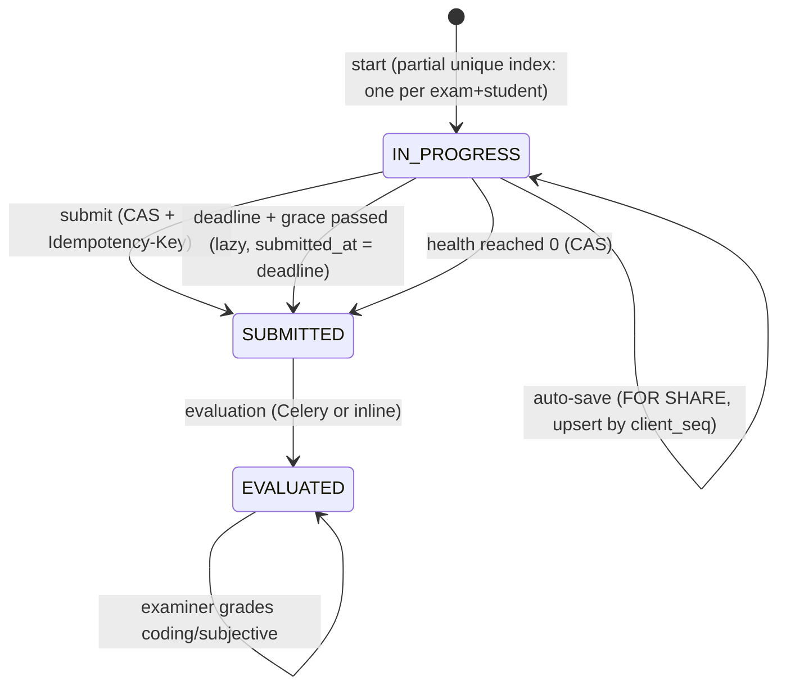
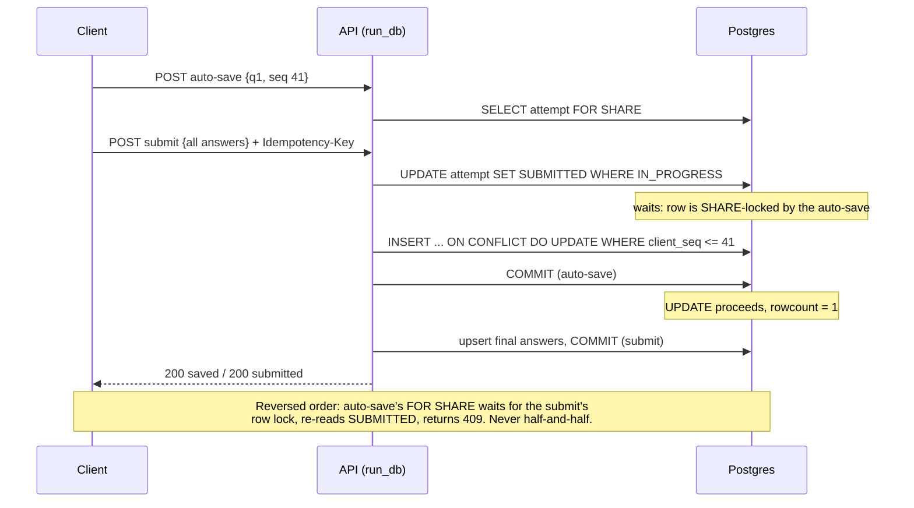
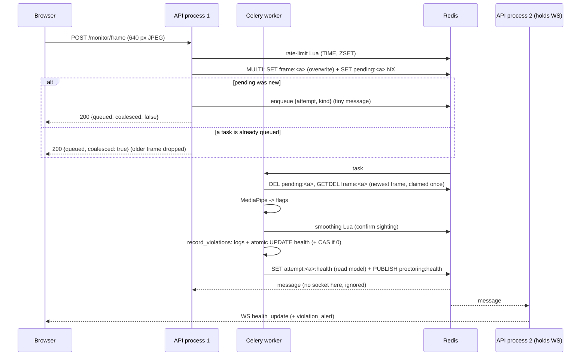

# Quizzie — Low-Level Design

## 1. Module layout (backend)

```
app/
  api/v1/            thin HTTP layer: auth, validation, status codes
    attempts.py      start / state / auto-save / submit / results / grading
    exams.py         exam CRUD, cached question delivery (student vs examiner view)
    monitoring.py    frame & audio upload -> Celery (or inline fallback)
    enhanced_monitoring.py  violations, health, recovery, WebSocket, live feed
  services/
    attempt_service.py   attempt lifecycle + invariants  (domain errors, no HTTP)
    evaluation_service.py scoring (single joinedload query), leaderboard invalidation
    evaluation_dispatch.py enqueue once + eval:pending marker; single-flight inline fallback
  ai_monitor/
    health.py        the ONLY writer of proctoring health (atomic UPDATE, publish)
    smoothing.py     N-sightings-in-window confirmation (Redis-backed)
  core/
    database.py      engine, async get_db, run_db (unit of work), release_connection
    cache.py         async Redis cache, get_or_compute (single-flight), invalidate_sync
    redis_client.py  sync Redis for workers/threads, with a 30 s "down" memo
    rate_limit.py    Lua sliding-window log: allow / allow_sync / hit_and_check_sync
    events.py        pub/sub publish + per-process subscriber loop
    limiter.py       slowapi limiter with Redis storage
    frame_mailbox.py latest-frame-wins slot per attempt (bounded queue, load shedding)
  worker/tasks/      Celery: proctoring_tasks, evaluation_tasks
```

Dependency direction: `api → services → models`; `ai_monitor.health → services.attempt_service` (for the shared close transition); nothing imports `api`.

## 2. Key interfaces

```python
class AttemptService:
    def __init__(self, db: Session, now: datetime | None = None)   # injectable clock
    def start(self, exam_id, student_id) -> ExamAttempt              # idempotent
    def get_state(self, attempt_id, student_id) -> dict              # resume payload
    def save_responses(self, attempt_id, student_id, answers: list[AnswerIn]) -> dict
    def submit(self, attempt_id, student_id, answers, idempotency_key) -> (ExamAttempt, {"replay", "late"})
    def finalize_if_expired(self, attempt) -> bool                   # lazy deadline close
    def close_for_health(self, attempt) -> bool                      # used by health.py
    # private: _close_attempt (the one CAS transition), _upsert, _validate_questions

# Domain errors -> HTTP (mapped in the router, not in the service)
AttemptNotFound 404 · NotAttemptOwner 403 · ExamNotLive 400 · AlreadySubmitted 400
AttemptClosed 409 · InvalidAnswer 422

@dataclass
class AnswerIn: question_id; selected_option_ids; answer_text; marked_for_review; client_seq

# core
async def run_db(db, fn, *a) -> T            # fn runs in threadpool; txn ended before return
async def RedisCache.get_or_compute(key, ttl, compute, lock_ttl=10)
async def rate_limit.allow(key, limit, window_s) -> bool     # + allow_sync, hit_and_check_sync
def events.publish_health(attempt_id, health, auto_submitted=False, alert=None) -> bool
async def events.run_subscriber(on_message, stop)
def health.record_violations(db, attempt, flags, ps=None, event_type=None) -> {"logged","auto_submitted","health"}
```

Design patterns you can name: **Service layer** (AttemptService), **Unit of Work**
(`run_db`), **Cache-aside** + **single-flight**, **Compare-and-set** state
transition, **Idempotency key**, **Publish/subscribe**, **Strategy-like fallback**
(Redis ↔ in-process windows), **Singleton** clients (cache, sync Redis).

## 3. Attempt state machine



All three `IN_PROGRESS → SUBMITTED` edges call the same `_close_attempt`:
`UPDATE ... WHERE id=:id AND status='IN_PROGRESS'` — `rowcount` says who won.

## 4. Sequence diagrams

### 4.1 Auto-save racing submit



### 4.2 Concurrent start

```mermaid
sequenceDiagram
    participant R1 as Request 1
    participant R2 as Request 2
    participant P as Postgres
    R1->>P: SELECT active attempt -> none
    R2->>P: SELECT active attempt -> none
    R1->>P: INSERT attempt (IN_PROGRESS) -> OK
    R2->>P: INSERT attempt (IN_PROGRESS)
    P-->>R2: unique_violation (uq_one_active_attempt)
    R2->>P: ROLLBACK; SELECT active attempt -> R1's row
    R1-->>R1: 201 {id: A}
    R2-->>R2: 201 {id: A}
```

### 4.3 Camera violation reaching the student's socket



### 4.4 Exam goes live (cold cache)

```mermaid
sequenceDiagram
    participant S as 500 students
    participant A as API
    participant R as Redis
    participant P as Postgres
    S->>A: GET /exams/{id}/questions (x500)
    A->>R: GET exam:{id}:questions -> miss (x500)
    A->>R: SET lock:exam:{id}:questions NX EX 10
    Note over A,R: 1 request wins the lock, 499 poll the cache
    A->>P: SELECT questions JOIN options (once)
    A->>R: SET exam:{id}:questions (TTL 300); release lock (compare-and-delete)
    A-->>S: 500 x student view (answer key stripped per request)
```

## 5. Database schema (relevant tables) and why

```
exam_attempts
  id uuid PK, exam_id FK, student_id FK
  status attemptstatus  (IN_PROGRESS | SUBMITTED | EVALUATED)
  started_at, deadline, submitted_at, time_taken_seconds
  score numeric(5,2), cheating_flags int, current_health int
  submit_idempotency_key varchar(64)
  -- cheating_flags is also the violation COUNT used by health (no COUNT(*))
  UNIQUE INDEX uq_one_active_attempt (exam_id, student_id) WHERE status='IN_PROGRESS'
  idx (student_id), (exam_id), (status), (exam_id, student_id)       -- migration 003

responses
  id uuid PK, attempt_id FK ON DELETE CASCADE, question_id FK
  selected_option_ids uuid[], answer_text text, marked_for_review bool
  is_correct bool, marks_awarded numeric(5,2), answered_at, client_seq bigint
  UNIQUE uq_response_attempt_question (attempt_id, question_id)
  idx (question_id)

cheat_logs
  id uuid PK, attempt_id FK ON DELETE CASCADE, flag_type, severity, timestamp, meta_data json
  idx idx_cheat_logs_attempt_ts (attempt_id, timestamp DESC)
```

| Decision | Reason |
|---|---|
| `deadline` stored, not derived | Editing the exam's duration mustn't move running attempts' end (ADR 0002). |
| Partial unique index, not a plain unique | Retakes must be allowed; only *active* attempts are unique. |
| `UNIQUE (attempt_id, question_id)` | The natural key of an answer; the upsert's conflict target; stops double-counting. |
| `client_seq bigint` | Orders edits by the client's sequence, not network arrival. |
| `submit_idempotency_key` on the attempt | Submit happens at most once per attempt, so the key can live on the row — no separate idempotency table, no TTL cleanup. |
| `current_health` column (not recomputed from logs) | O(1) reads; atomic decrement; logs remain the audit trail (`recompute_from_logs` for repair). |
| `(attempt_id, timestamp DESC)` on `cheat_logs` | Serves "latest flag per attempt" (`DISTINCT ON`) in the live feed and the timeline sort. Makes the old `(attempt_id)` index a redundant prefix → dropped. |
| `idx_responses_attempt_id` dropped | Left prefix of the unique index; every auto-save paid to maintain it. |
| UUID PKs | Fine at this scale; worth knowing random UUIDs fragment B-tree inserts (UUIDv7 / bigserial would be the fix at very high write rates). |

Migration `006` repairs data that already violates the new constraints (duplicate
answers → keep latest; duplicate active attempts → keep newest, close others)
before creating them, and backfills `deadline` for running attempts.

```
users (relevant columns)
  email unique, role, is_verified
  token_version int NOT NULL DEFAULT 0      -- migration 007; JWT claim "tv"

Redis keys (all with TTLs except broker queues — hence volatile-lru)
  user:<email>                60 s   auth cache
  exam:<id>:meta / :questions 60 s / 5 min, lock:<key> 10 s (single-flight)
  exam:<id>:leaderboard       30 s   (deleted when an evaluation completes)
  attempt:<id>:health         4 h    health read model {owner, data}
  rl:<name>:<attempt>, sm:<attempt>:<flag>   sliding-window ZSETs
  frame:<kind>:<attempt> 10 s, pending:<kind>:<attempt> 30 s   mailbox
  eval:pending:<attempt> 60 s, lock:eval:<attempt> 30 s
```

## 6. Frontend design (exam page)

- **`examStore` (Zustand):** answers keyed by question id, each with `clientSeq`;
  a `dirty: Map<questionId, seq>`; `deadlineMs` + `serverOffsetMs`; `tick()`
  recomputes remaining time (no decrementing counter).
- **`useAutoSave`:** subscribes to `dirty` without re-rendering; debounce 1.5 s /
  max-wait 10 s; single-flight; backoff to 30 s; `409` → attempt closed → results;
  `visibilitychange`/`pagehide` → `fetch(keepalive)` flush with the auth header.
- **`TakeExam`:** resolve attempt (history state, else idempotent `/start`) →
  `/state` → `initExam` (indexes rebuilt from option UUIDs) → merge any
  localStorage-pending answers newer than the server's → timer at 0 → UI locks →
  submit after 0–10 s jitter; submit retried 3× with the same `Idempotency-Key`.
- **`useAutoSave` offline mirror:** the dirty set is written to
  `localStorage["quizzie:pending:<attempt>"]` on every change and cleared as saves are acked.
- **`ExamResults`:** polls `GET /results` with backoff while it returns 202 "evaluating".
- **`CameraProctoring`:** frames downscaled to ≤ 640 px wide, JPEG q = 0.7.
- **`authStore.logout`:** best-effort `POST /auth/logout` (server revocation) unless called from the 401 handler.
- **`HealthBar`:** same-origin WebSocket (via nginx/Vite proxy), handles
  `health_update`, `violation_alert`, `auto_submitted`; backstop poll every 60 s
  while the socket is up, 10 s while it's down (served from the Redis snapshot).

## 7. Test map

| Test file | Proves |
|---|---|
| `test_attempt_integrity.py` (20) | auto-save persistence/idempotency/ordering/foreign-question rejection, crash-then-submit, deadline + grace, late payload ignored, lazy finalization, idempotent submit, answer key hidden, recovery policy |
| `test_concurrency.py` (5) | real multi-connection races: one active attempt, exactly-once submit, same-key retries, auto-save never after submit (mutation-tested: removing the `FOR SHARE` lock makes it fail 10/10), no lost health penalties |
| `test_distributed.py` (11) | shared rate limit across "replicas", per-process fallback is 2×, sliding window, cross-worker smoothing, stampede → 1 compute, user cache skips `users`, pub/sub delivery, multi-socket fan-out, WebSocket end-to-end from another process |
| `test_load_shedding_and_revocation.py` (16) | results 202 without evaluating / single-flight fallback, no `COUNT(*)` on the violation path, health poll with zero SQL and owner check, mailbox coalescing (8 uploads → 1 task, newest frame wins), failed enqueue releases the slot, logout revokes every session, pre-upgrade tokens still valid, revocation beats the user cache, login throttled per account (a classmate on the same IP still gets in) |
| original 37 tests | unchanged behaviour of auth, exams, attempts, analytics, evaluation |
